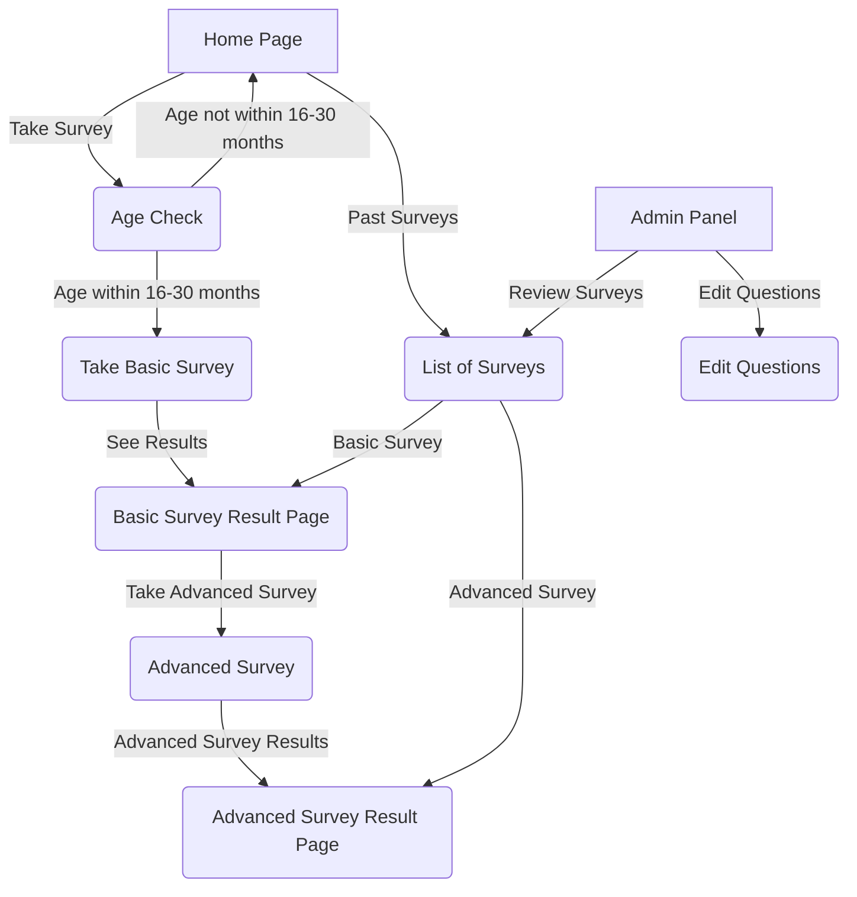

## Model 

```mermaid
classDiagram

    class Backend{
        load_survey(guid) returns Survey, loads historical one
        register_new_survey(): returns id and guid
        save_survey(Survey): saves it to backend (and locally!)
        get_empty_survey(): get Survey details for user to fill in
    }

    class Survey{
        id/guid - when is a filled/being filled one 
        birth date 
        postal code
        
        getTopLevelQuestions(): List of Nodes
        getNodeByID(String): Node
    }

    Survey --"*" Node

    class Node {

    }

    Node --> NodeStatus
    Node --> NodeAnswer

    class NodeStatus{
        (enum actually)
    }

    class NodeAnswer{
        (enum actually)
    }

```

## Page Graph
