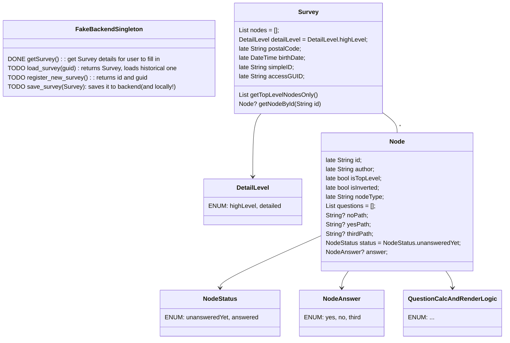

## Model 

```mermaid
classDiagram

    class FakeBackendSingleton{
        DONE getSurvey(): get Survey details for user to fill in
        TODO load_survey(guid) returns Survey, loads historical one
        TODO register_new_survey(): returns id and guid
        TODO save_survey(Survey): saves it to backend (and locally!)
    }

    class Survey{
        List<Node> nodes = [];
        DetailLevel detailLevel = DetailLevel.highLevel;
        late String postalCode;
        late DateTime birthDate;
        late String simpleID;
        late String accessGUID;

        List<Node> getTopLevelNodesOnly()
        Node? getNodeById(String id)
    }

    class DetailLevel { ENUM: highLevel, detailed }
    class QuestionCalcAndRenderLogic{ ENUM: ...}

    class NodeStatus { ENUM: unansweredYet, answered }

    class NodeAnswer { ENUM: yes, no, third }


    class Node {
        late String id;
        late String author;
        late bool isTopLevel;
        late bool isInverted;
        late String nodeType;
        List<Question> questions = [];

        String? noPath;
        String? yesPath;
        String? thirdPath;

        NodeStatus status = NodeStatus.unansweredYet;
        NodeAnswer? answer;


    }

  Survey --"*" Node
    Node --> NodeStatus
    Node --> NodeAnswer
    Node --> QuestionCalcAndRenderLogic
    Survey  --> DetailLevel

  


```