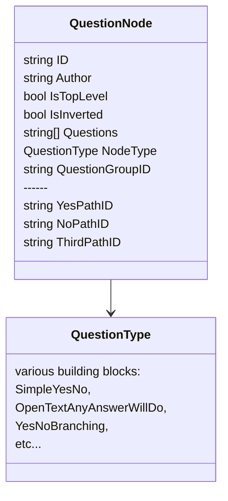

Below is the starting model that sums up how we decomposed the "domain".

Flutter will be having a "QuestionType" visualizer and a "SurveyNavigator" that will take the user through the survey. 

The plan is to have less QuestionTypes than QuestionNodes (i.e. less than 20) and looks like this will be doable. 

