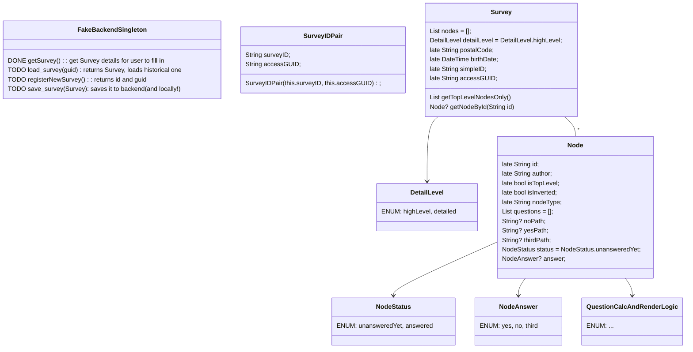
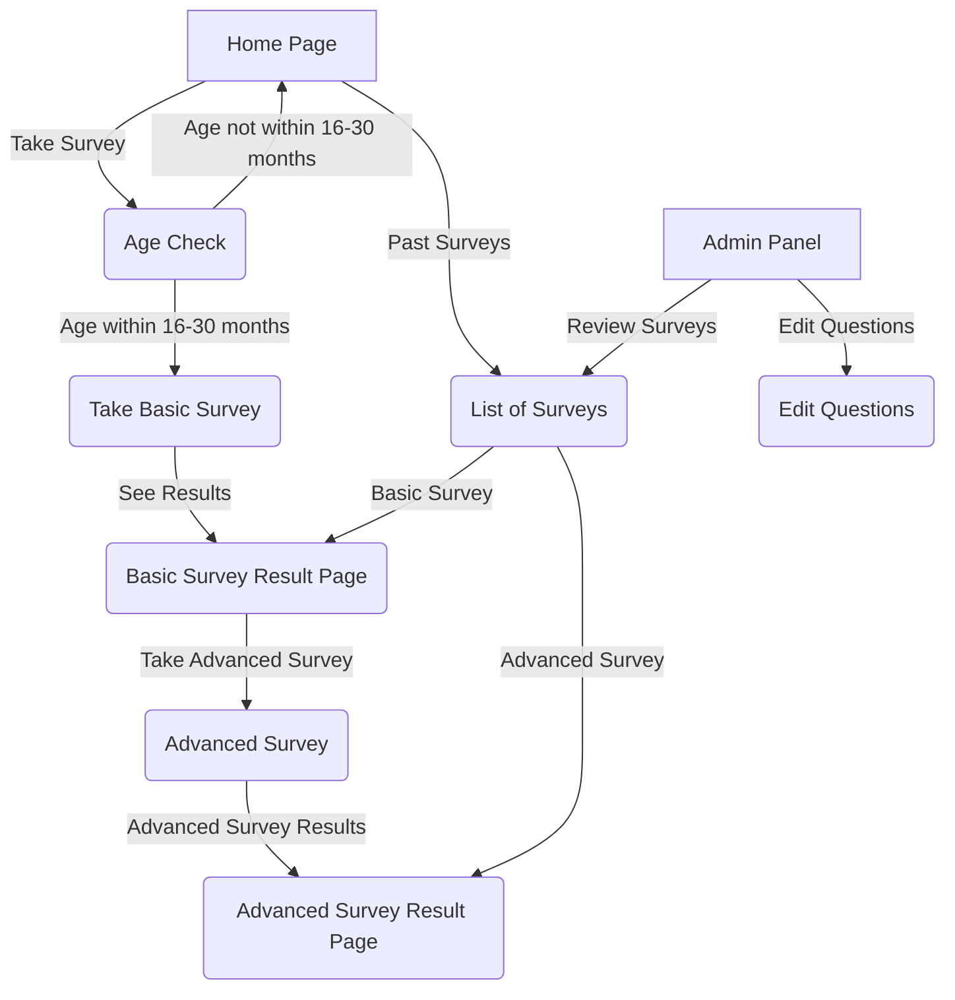

## Model 

```mermaid
classDiagram

    class FakeBackendSingleton{
        DONE getSurvey(): get Survey details for user to fill in
        TODO load_survey(guid) returns Survey, loads historical one
        TODO registerNewSurvey(): returns id and guid
        TODO save_survey(Survey): saves it to backend (and locally!)
    }

    class SurveyIDPair {
        String surveyID;
        String accessGUID;
        SurveyIDPair(this.surveyID, this.accessGUID);
    }

    class Survey{
        List<Node> nodes = [];
        DetailLevel detailLevel = DetailLevel.highLevel;
        late String postalCode;
        late DateTime birthDate;
        late String simpleID;
        late String accessGUID;

        List<Node> getTopLevelNodesOnly()
        Node? getNodeById(String id)
    }

    class DetailLevel { ENUM: highLevel, detailed }
    class QuestionCalcAndRenderLogic{ ENUM: ...}

    class NodeStatus { ENUM: unansweredYet, answered }

    class NodeAnswer { ENUM: yes, no, third }


    class Node {
        late String id;
        late String author;
        late bool isTopLevel;
        late bool isInverted;
        late String nodeType;
        List<Question> questions = [];

        String? noPath;
        String? yesPath;
        String? thirdPath;

        NodeStatus status = NodeStatus.unansweredYet;
        NodeAnswer? answer;


    }

  Survey --"*" Node
    Node --> NodeStatus
    Node --> NodeAnswer
    Node --> QuestionCalcAndRenderLogic
    Survey  --> DetailLevel

  


```

## Page Graph

```mermaid
graph TD
  Home[Home Page] --> |Take Survey| AgeCheck(Age Check)
  AgeCheck --> |Age within 16-30 months| BasicSurvey(Take Basic Survey)
  AgeCheck --> |Age not within 16-30 months| Home
  BasicSurvey --> |See Results| BasicResults(Basic Survey Result Page)
  BasicResults --> |Take Advanced Survey| AdvancedSurvey(Advanced Survey)
  AdvancedSurvey --> |Advanced Survey Results| AdvancedResults(Advanced Survey Result Page)
  
  Home --> |Past Surveys| SurveyList(List of Surveys)
  SurveyList --> |Basic Survey| BasicResults
  SurveyList --> |Advanced Survey| AdvancedResults
  
  Admin[Admin Panel] --> |Edit Questions| EditQuestions(Edit Questions)
  Admin --> |Review Surveys| SurveyList(List of Surveys)
```