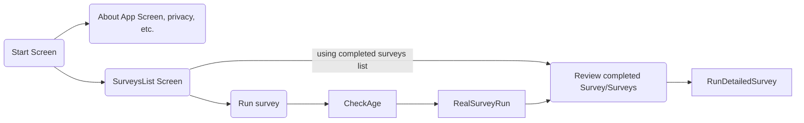

## Requirements (high level)

1. There can be more than one kid surveyed per user (i.e. twins)
    + each kid gets an easy to spell out survey ID and a second GUID style ID that ensures accessing it for anyone but parent and Synapsis is 
    + this GUID style ID allows super-user from Synapsis to look up the survey results if needed, it is not known to the app user
2. First user can only do the **"topline"** survey (questions 1-20 without sub-questions)
3. results 0-2 or 8+ are a final result while 3-7 is where the **follow-up survey** is to be available. 
4. for follow-up survey, the answers from the "topline" survey are **not used**, it is a redo of the complete survey, but asking all the details from the "survey tree"
5. ...

