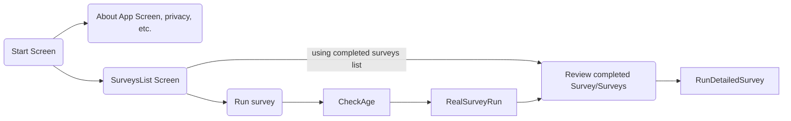
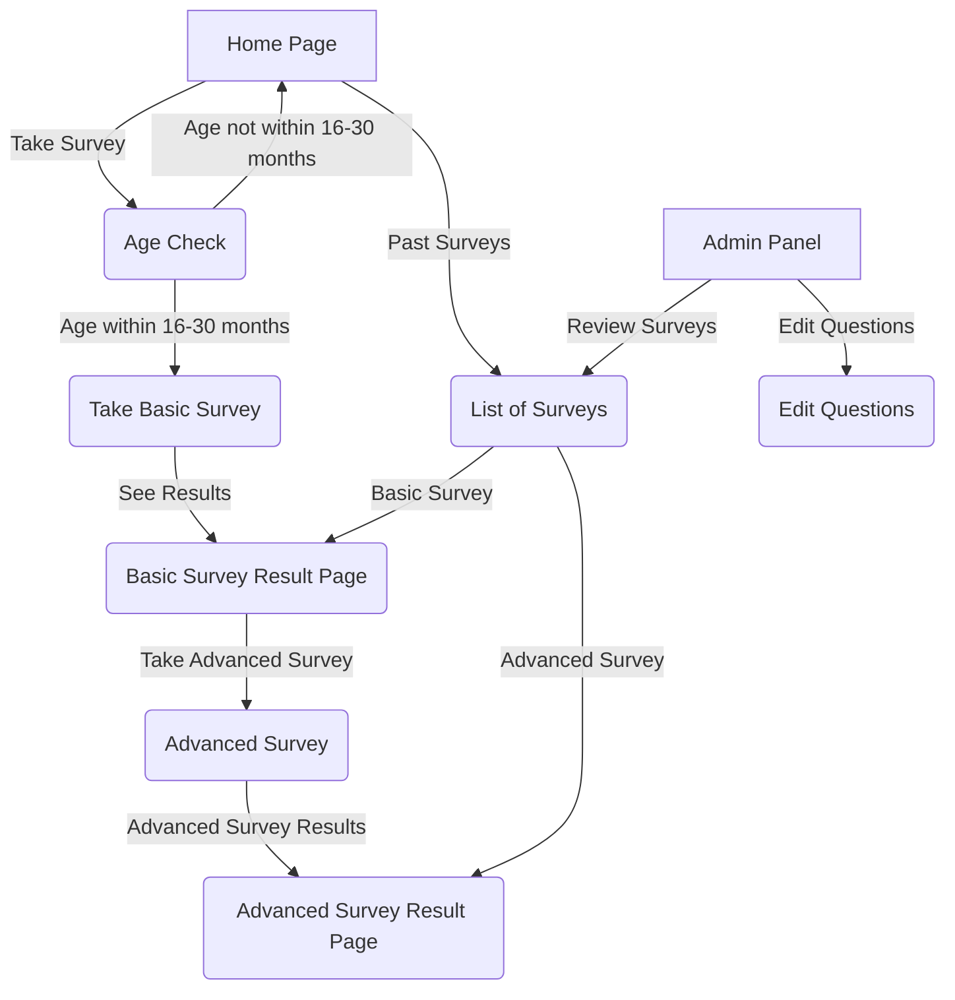

## Requirements (high level)

1. There can be more than one kid surveyed per user (i.e. twins)
    + each kid gets an easy to spell out survey ID and a second GUID style ID that ensures accessing it for anyone but parent and Synapsis is 
    + this GUID style ID allows super-user from Synapsis to look up the survey results if needed, it is not known to the app user
2. First user can only do the **"topline"** survey (questions 1-20 without sub-questions)
3. results 0-2 or 8+ are a final result while 3-7 is where the **follow-up survey** is to be available. 
4. for follow-up survey, the answers from the "topline" survey are **not used**, it is a redo of the complete survey, but asking all the details from the "survey tree"
5. ...

## Barteks' Notes:

I'm just uploading it here, so it will not get lost. The guys from organising team have original paper with psychologist drawings. 

I'll review the questions and simplify it later.

For now, I think its just enough to say that:
1. we generally don't do open question followed by closed questions
2. missing branch with all "no" answers have been defined
3. some "others" were removed
4. we generally tend to give the kid more points than less, reason being: we tolerate false positives, but we'd rather not tolerate false negatives (nothing happens when healthy kid goes to a doctor, but kid with autism not being diagnosed might be harmful)

## Page Graph

